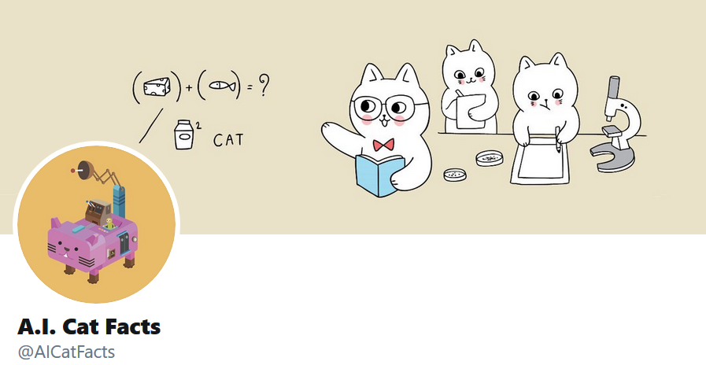

# 

This is a Azure function app, which uses timer triggered events to execute various actions and generate content to post to the @AICatFacts twitter account. It calls a separate API to return responses from GPT-2 based language models that have been fine-tuned to generate cat facts and respond to tweets. The models are based on the full 1558M / 1.5 billion parameter release of GPT-2, and were trained and deployed seperately.

Thanks to [MarkovCatFacts](https://github.com/itchison/MarkovCatFacts) for inspiration!

